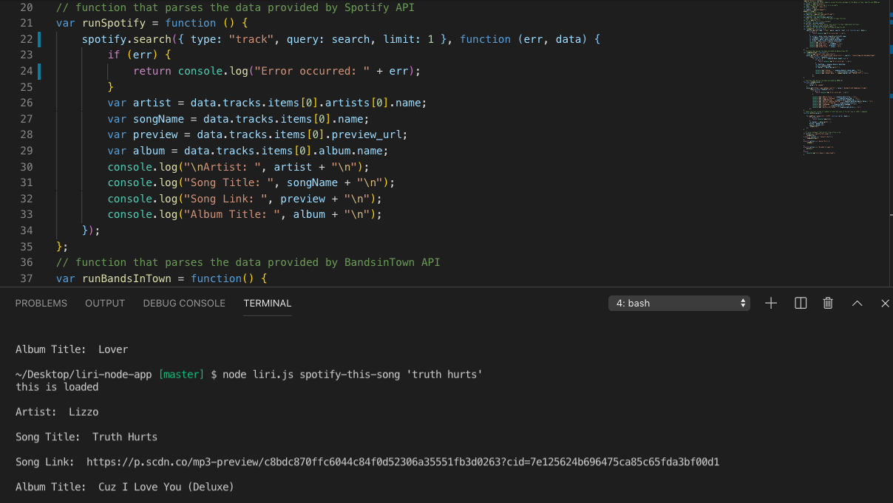
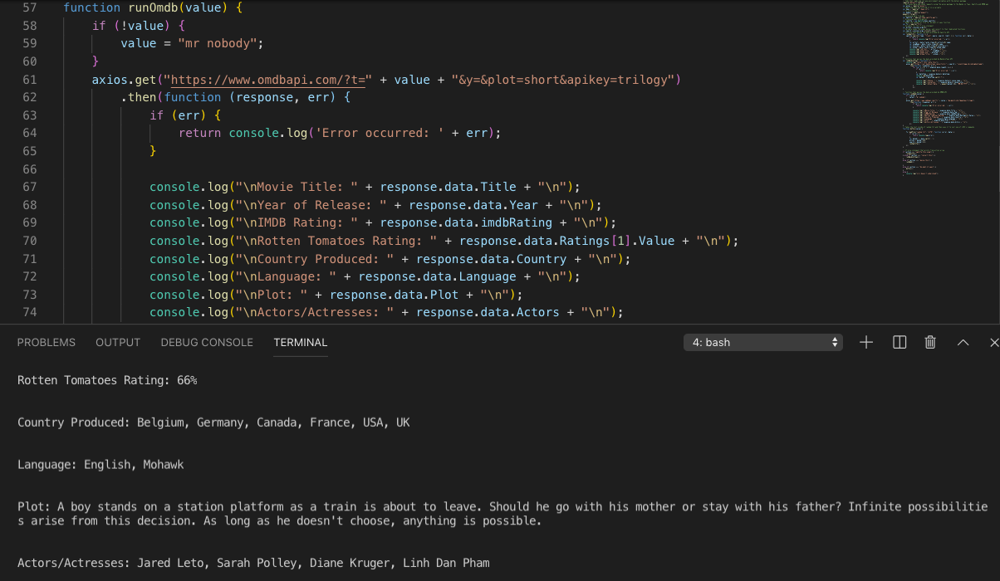
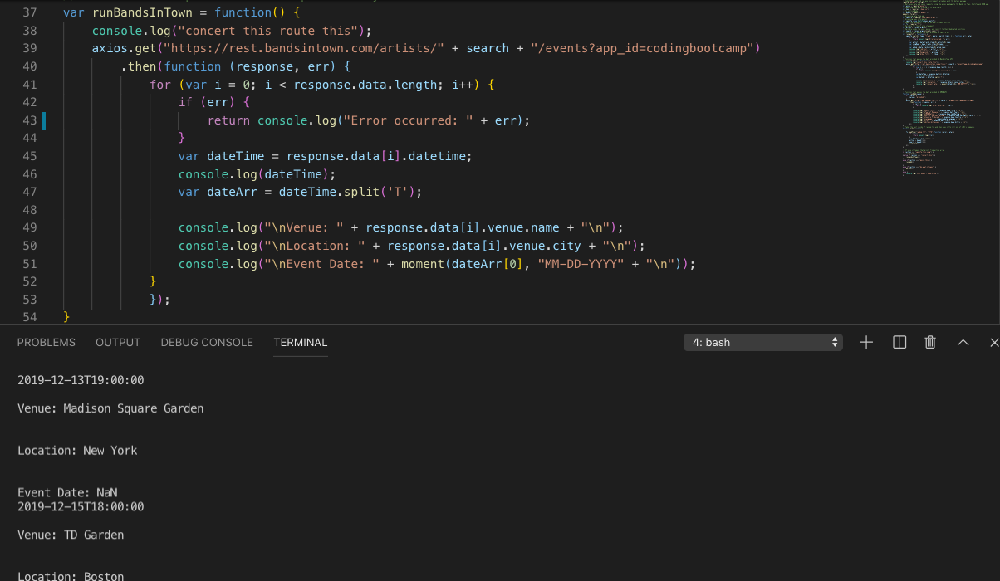
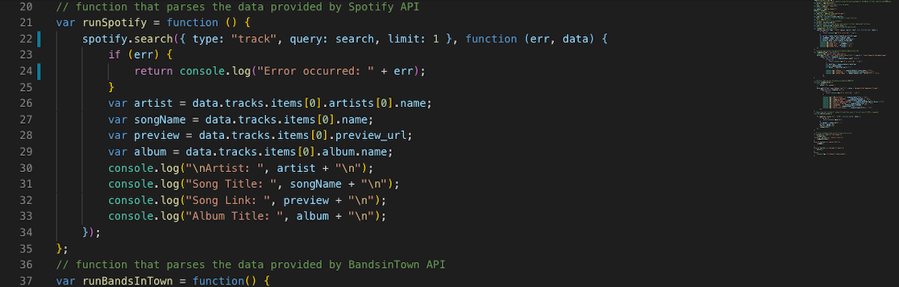
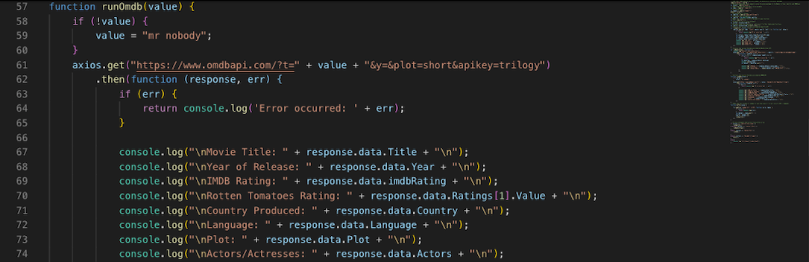
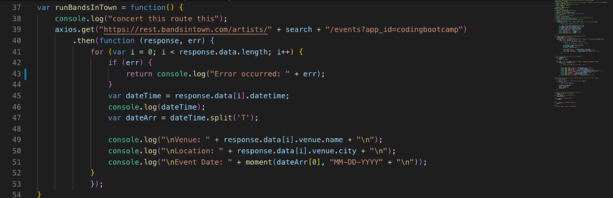

# liri-node-app

[GitHubSite](https://flexsant.github.io/liri-node-app/)

## Summary
LIRI is a Language Interpretation and Recognition Interface. LIRI will be a command line node app that takes in parameters and gives you back data.

## Visual Aids
Javascript Spotify

Javascript OMDB

Javascript BandsInTown

## User Guides
- In order for LIRI to search Spotify for songs, Bands in Town for concerts, and OMDB for movies for you must first open your Git Bash Terminal and locate the proper folder.

- Once you have navigated into the correct folder, you can start typing the following commands to get information.

1. node liri.js spotify-this-song "song name here"
This command allows Liri to search for the songs artists, url-preview(if available), year the track was recorded, and album title.
2. node liri.js concert-this "band name"
This command allows Liri to search for upcoming shows/events of the band/artists name you entered. 
3. node liri.js movie-this "movie name"
This command allows Liri to search for basic information about the movie you are inquiring about.
4. node liri.js do-what-it-says ""
This command allows Liri to search Spotify for "I want it that way" by Backstreet Boys

## Code Snippet
Javascript Spotify

Javascript OMDB

Javascript BandsInTown

## Technologies Used
- AXIOS - javascript library to perform HTTP requests in browser or node.js platforms
- Bands in Town API - access to local concerts, live music dates, times, and locations.
- CSS - styles html elements on page
- HTML - used to create elements on the DOM
- Git - version control system to track changes to source code
- GitHub - hosts repository that can be deployed to GitHub Pages
- Javascript - allows dynamic interaction between user and computer data entry
- JQuery - a javascript library that allows for simple yet more diverse and less verbos.
- Moment - npm package, javascript library that helps manage dates
- NODE.js - javascript run-time environment that can be run outside of browser
- OMDB API - open movie data base
- Spotify API - access to spotify music library

## Learning Points 
- Installing NPM node packages
- Utilizing processargv alongside for loops to generate search queries
- Handling API calls with Node instaed of AJAX
- Utilizing .ENV node package to handle and import secret keys
- Utilizing fs node package to read search queries from text files

## Author Links
[GitHub](https://github.com/flexsant)
[LinkedIn](https://www.linkedin.com/in/lex-santos-673623194/)
[Portfolio](https://flexsant.github.io/Basic-Portfolio/)